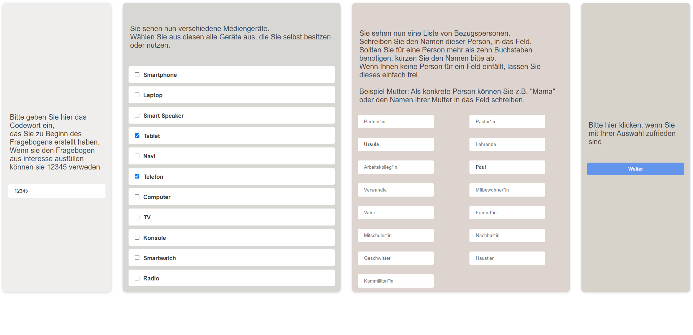
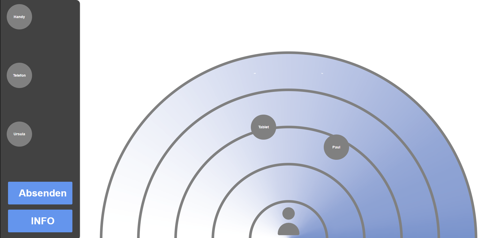

## POD - interactive questionnaire
This is an interactive questionnaire to determine the social distance to devices and persons.  
It was build for the course "UX of interactive Systems" at Julius-Maximilian-Universität Würzburg

## Functionality

1. Choose devices and persons 
2. Watch explanation video 
3. position people and devices 
